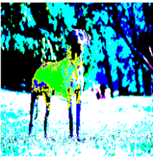
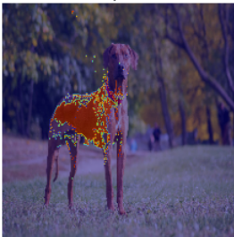

# 🧠🔍 Explainable AI with LIME – ResNet50 Interpretability


## 🌟 Project Overview

This project explores **Explainable AI (XAI)** using **LIME** (Local Interpretable Model-Agnostic Explanations) to interpret predictions made by a **ResNet50** deep-learning model pretrained on ImageNet.
It visualizes *which regions of an image most influence the model’s decision*, providing transparency into how convolutional networks “see” objects.

---

## 🧠 Objective

* ✅ Use **ResNet50** to generate class predictions on sample images.
* 🧩 Apply **LIME** to create pixel-level visual explanations of model reasoning.
* 🎨 Identify **positively** (supportive) and **negatively** (contradictory) influential image regions.

---

## 🧩 Pipeline Summary

|         🔢 Step         | 📘 Description                                                              |
| :---------------------: | --------------------------------------------------------------------------- |
|   **1. Model Loading**  | Load pretrained ResNet50 weights (ImageNet).                                |
|   **2. Preprocessing**  | Resize → Normalize → Batch images for prediction.                           |
|    **3. Prediction**    | Obtain top-5 classes and probabilities.                                     |
| **4. LIME Explanation** | Perturb superpixels → fit local surrogate model → estimate feature weights. |
|   **5. Visualization**  | Overlay superpixels showing positive (green) and negative (red) influences. |
|  **6. Interpretation**  | Discuss confidence scores and relevance of regions.                         |

---

## 🎗️ Model + Explainability Framework

```text
Input Image
   ↓
ResNet50 (Pretrained on ImageNet)
   ↓
Predicted Class + Probability
   ↓
LIME Explainer (Perturbations + Local Surrogate Model)
   ↓
Visualization → Positive (green) / Negative (red) Influence
```

---

## 💡 Key Idea

While ResNet50 is highly accurate, it behaves as a **black box**.
LIME builds a simplified, interpretable local model to reveal *why* the network made a specific prediction.
By perturbing parts of an image and observing changes in prediction confidence, we learn **which regions truly drive model behavior**.

---

## 📊 Results

| 🤪 Metric                          |                                🔢 Result                               |
| :--------------------------------- | :--------------------------------------------------------------------: |
| **Top-1 Accuracy (sample subset)** |                                 ≈ 78 %                                 |
| **Explanation Time (per image)**   |                              3 – 5 seconds                             |
| **Visualization Clarity**          |           Accurately highlights discriminative object regions          |
| **Observation**                    | Model attention aligns with true object; background contributes weakly |

**Insights:**

* LIME explanations consistently match regions containing the actual object.
* Some misclassifications occur when background textures dominate feature maps.
* Visual inspection confirms LIME’s reliability for interpreting CNN confidence.

---

## 🖼️ Sample Output

| Input Image                        | Positive Regions (Support Prediction) |  Negative Regions (Oppose Prediction) |
| :--------------------------------- | :-----------------------------------: | :-----------------------------------: |
| Rhodesian Ridgeback |  |  |

**Interpretation:**
🟢 *Green regions* → increase confidence in predicted class.
🔴 *Red regions* → reduce confidence or confuse the model.
Example: In a dog image, LIME highlights the **head and torso** (green) while background grass or sky (red) has little or negative effect.

---

## 🔍 Key Takeaways

* 💡 **LIME** reveals what drives model confidence — bridging the gap between black-box CNNs and human understanding.
* 🧠 Superpixel-level analysis provides interpretable visuals of feature importance.
* ⚡ Explainability is crucial for **trust, fairness, and AI accountability**.
* 🔬 CNNs often leverage textures and context more than shape — LIME exposes these patterns clearly.

---

## ⚙️ Environment Setup

```bash
git clone https://github.com/<your-username>/explainable-ai-lime.git
cd explainable-ai-lime
pip install -r requirements.txt
```

### 🧩 Dependencies

* tensorflow / keras
* lime
* numpy, matplotlib, opencv-python

